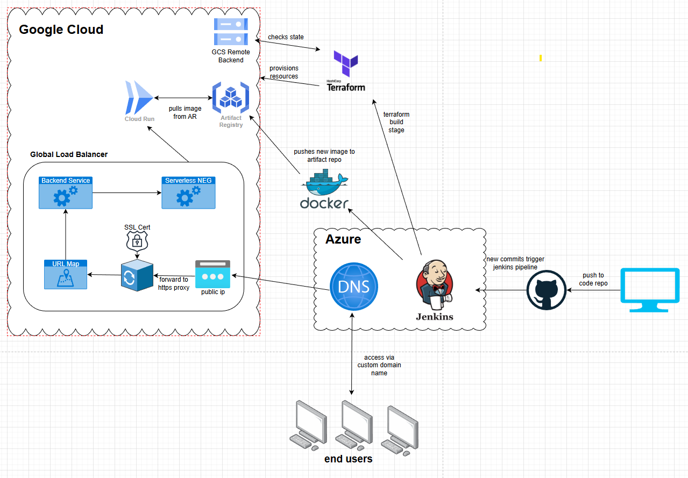

# Unity Web App hosted in Google Cloud
This project demonstrates a full CI/CD pipeline for deploying a Unity WebGL game as a containerized web application on Google Cloud Run, with Terraform-managed infrastructure, a global HTTPS load balancer, and a custom domain secured via Google Managed SSL
---

## Technologies Used
- Google Cloud Platform : Cloud Storage, Artifact Registry, Cloud Run, Load Balancing, Certificate Manager
- Azure : Hosting Jenkins VM, DNS Hosted Zones
- Docker : For container packaging
- Jenkins : For CI/CD
- Git/GitHub : Soruce Code Repository
- Terraform : Programaticaly provisioning infrastructure

---

## Useful Links
- [Terraform GCP Provider Documentation](https://registry.terraform.io/providers/hashicorp/google/latest/docs)  
  Official resource for defining GCP resources using Terraform.

- [GCP Cloud Run Documentation](https://cloud.google.com/run/docs/)  
  Fully managed application platform for running containers in GCP

- [Global Load Balancing with Cloud Run](https://docs.cloud.google.com/load-balancing/docs/https/setup-global-ext-https-serverless)  
  Goes over how to route request to serverless backends using an external ALB

- [Jenkins Documentation](https://www.jenkins.io/doc/)  
  Automate CI/CD pipelines to deploy infrastructure and sync content.

- [Unity Documentation](https://docs.unity.com/en-us)  
  For learning how to use the Unity game engine

---

## Security & Best Practices
1. **Keep Bucket Names Private**  
   Bucket names should always be stored in a 'terraform.tfvars' or a 'locals.tf" file and should be part of your .gitignore. Public exposure could lead to brute force object discovery or abuse

2. **Use Principle of Least Priviledge**  
   When creating your *Service Account* in GCP, only give it permissions to do the task required. You should not overpermission this account.

3. **Terraform State**  
   Terraform state should always be part of your .gitignore if being stored locally. I would reccomend to use a remote backend like a *GCS Bucket* and then limiting access on that bucket. Terrafrom state can contain sensitive information like public IPs so always best to limit access to it.

4. **Tagging Infrastructure**
   Tagging is a best practice in infrastructure management, especially in production environments. I’ve intentionally left out tags, as tagging strategies should be tailored to your organization’s workflow and standards. I'd reccomend to define a consistent tagging policy that outlines required tags (e.g., Environment, Owner, CostCenter) and ensures meaningful metadata is applied to all resources for visibility, cost tracking, and governance.

---
# Architecture Diagram

---

## How-To Guide

### Step 1: GitHub and Terraform Setup  
Create a new GitHub repository to manage your source code with version control. Clone this repository locally to organize your Terraform files, scripts, and other resources. This repo will also integrate with Jenkins later for automated deployments.

### Step 2: GCS Bucket Creation
Use Terraform to provision a bucket in GCS. This will be used to store our terraform state so we aren't storing this locally.

### Step 3: Establishing GCP and Jenkins connections
Create a new service account in GCP and create a JSON key with it as we will let Jenkins use this account for managing/creating resources. In our Github repo create a webhook and point it at your Jenkins VM. We also need to create a Github SSH key to let Jenkins authenticate with our private repos.

### Step 4: DockerFile creation and first pipeline stages
Create a basic Dockerfile using nginx:alpine as our base and copying our nginx.conf and unity build files to their respective locations. We can expose 8080 on the container.
In our Jenkinsfile we will set up our environment variables required for building the image *LOCATION* , *PROJECT ID*, *REPOSITORY*, and *IMAGE*.  

Pipeline stages we are adding are
- Stage 1 : Clone our main branch using our Github SSH key we created earlier.
- Stage 2 : Docker.Build step that uses our Dockerfile to build an image

### Step 5: Terraform Set-Up
We need to now create our terraform files. Create a terraform.tf to store our provider info, a main.tf for resources and then a variables.tf for any variables. I've put this all under an infrastructure folder.
- terraforrm.tf : Add a provider block an include google as well as google beta. We also want to provision a GCS bucket an point our backend to use it
- variables.tf : add any repeatable values as variables incase we ever want to modularize this set up
- main.tf : create a artifact registry repository resource (we will store our images here)

### Step 6: Pushing images to artifact repository
Now with our AR created an pipeline stage to create docker images, we want to push these images to GCP. We'll create 2 new pipeline stages
- Stage 3: Authenticate to our artifact repository using the service account we created. (This should be stored in jenkins as a secret file)
- Stage 4: Simple DockerImage.push to push the latest imaage to our repo.

### Step 7: Creating our Cloudrun Service
Lets create a cloudrun v2 service in main.tf and expose port 8080 as well as set our desired min/max amount of instances.  
We also need to create a cloudrun v2 iam member an give the run.invoker role to everyone. This allows anyone to access our service.

### Step 8: Terraform Build Pipeline Stage
We need to create a stage in our pipeline to build all of our resources in main.tf. We can use the same service account we made earlier and create a new stage that runs the following
- terraform fmt (to clean up our file)
- terraform init (initializes our providers)
- terraform plan (creates a plan of what we are building)
- terraform apply -auto-approve (builds the infrastructure)

### Step 9: Load Balancer configuration
Now if we want to add a custom domain to our Cloud Run service we need to put it behind an global load balancer. In main.tf we are going to provision a few resources to get this set up
- google_compute_global_address : Global static IPv4 address for the load balancer frontend.
- google_compute_region_network_endpoint_group : Serverless NEG that references the Cloud Run service.
- google_compute_managed_ssl_certificate : Google-managed certificate for HTTPS (automatically provisioned and renewed).
- google_compute_backend_service : Backend definition that points to the serverless NEG.
- google_compute_url_map — Routing rules; default route points to the backend service.
- google_compute_target_https_proxy : Handles HTTPS termination and connects to the URL map.
- google_compute_global_forwarding_rule : Maps incoming traffic on port 443 to the HTTPS proxy.

### Step 10: Update DNS
Once we have our load balancer in place, all we need to do from a DNS standpoint is create a new A record wherever your domain is hosted at and point it to the external IP of your load balancer. Once the SSL cert is showing as Active you should be able to access via your custom domain.

